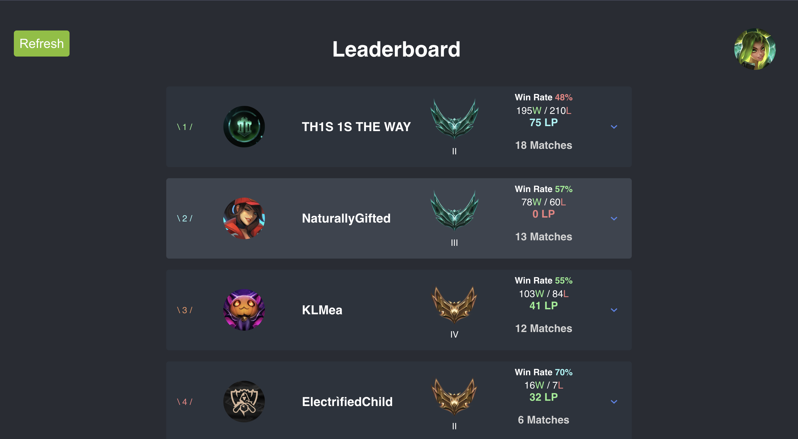
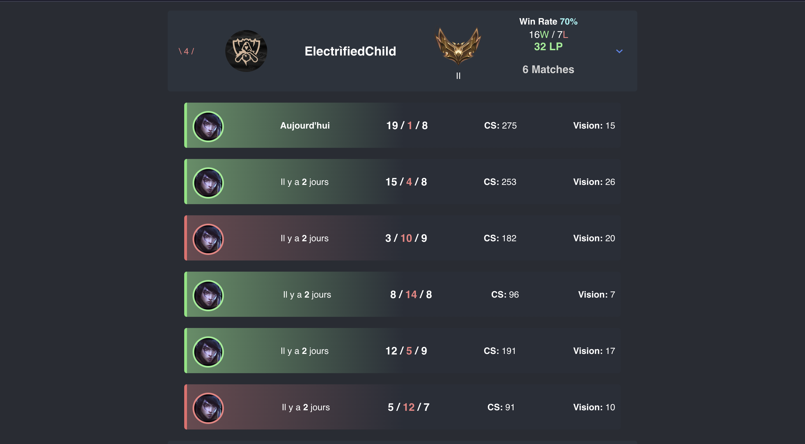
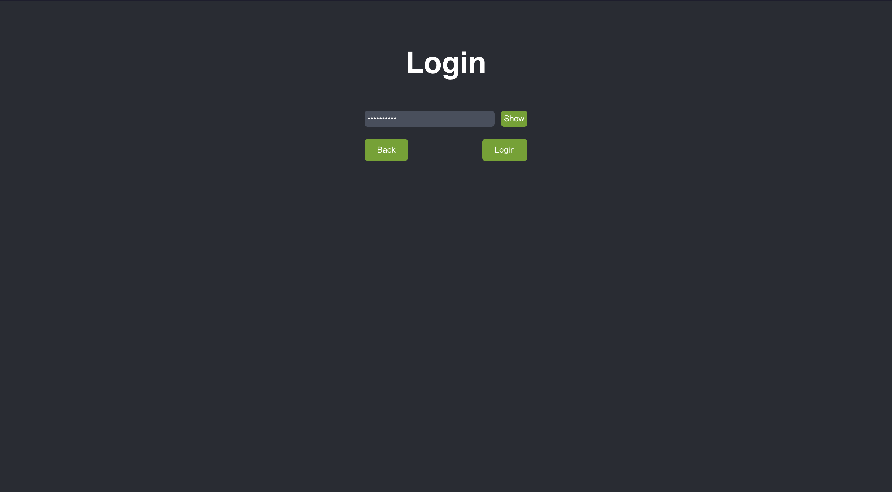
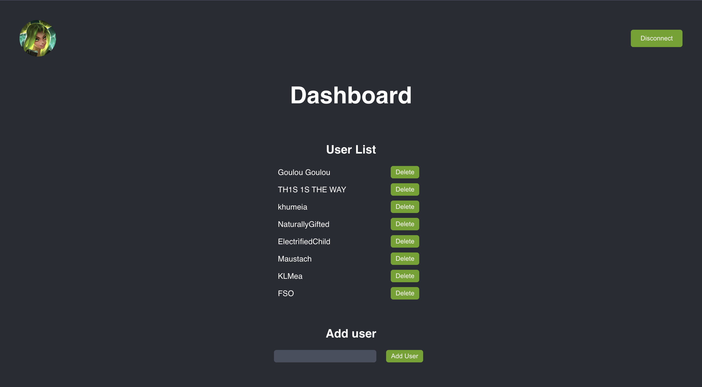

<h1>Leaderboard 🏆</h1>

This project is a leaderboard application built with React and Express. It displays the stats and matches of summoners and allows users to refresh the data, view match details, and navigate to a dashboard. 💪

<h2>Features ✨</h2>
<ul>
   <li>Fetch summoner stats and match data from an API 📊</li>
   <li>Display a leaderboard with summoner information 🏆</li>
   <li>Allow users to refresh the data 🔄</li>
   <li>Show match details for selected summoners 🕹️</li>
   <li>Navigate to a dashboard 📈</li>
</ul>
<h2>Preview 📷</h2>

Here is a preview of the leaderboard. 🏆

  

Here is a preview of the match details. 🕹️

  

Here is a preview of the dashboard. 📈

  

  

<h2>Prerequisites 📋</h2>
<ul>
   <li>Node.js</li>
   <li>npm</li>
   <li>MySQL</li>
</ul>
<h2>Installation 🛠️</h2>
<ol>
   <li>Clone the repository: <code>git clone &lt;repository-url&gt;</code> 📥</li>
   <li>Install dependencies: <code>npm install</code> 📦</li>
</ol>
<h2>Usage 🚀</h2>
<ol>
   <li>Start the server: <code>npm run server</code> 🖥️</li>
   <li>Start the React application: <code>npm start</code> 🚀</li>
   <li>Open your browser and visit <code>http://localhost:3000</code> to view the leaderboard. 🌐</li>
</ol>
<h2>Dependencies 📦</h2>
<ul>
   <li>React ⚛️</li>
   <li>React Router DOM 🌐</li>
   <li>Axios 🌐</li>
   <li>MySQL2 🗄️</li>
   <li>Express 🚀</li>
   <li>Cors 🌐</li>
</ul>
<h2>API Endpoints 🌐</h2>
<ul>
   <li><code>GET /allSummonerNames</code>: Retrieves all summoner names and icon IDs. 📜</li>
   <li><code>GET /summonerStats/:summoner</code>: Retrieves summoner stats for a given summoner. 📊</li>
   <li><code>GET /summonerMatches/:summoner</code>: Retrieves summoner matches for a given summoner. 🎮</li>
   <li><code>POST /refreshAll</code>: Refreshes all summoner stats and match data. 🔄</li>
   <li><code>GET /summonerMatchesDetails/:matchId/:summonerName</code>: Retrieves match details for a specific match and summoner. 🕹️</li>
</ul>
<h2>Database 🗄️</h2>

The project uses a MySQL database to store summoner and match data. The database is hosted locally and can be configured in the code. 📊

<h2>Contributing 🤝</h2>

Contributions, issues and feature requests are welcome. 🙌

<h1></h1>
<h3>Made with ❤️ by <a href="https://github.com/Marin-Clement">Marin Clement</a></h3>
